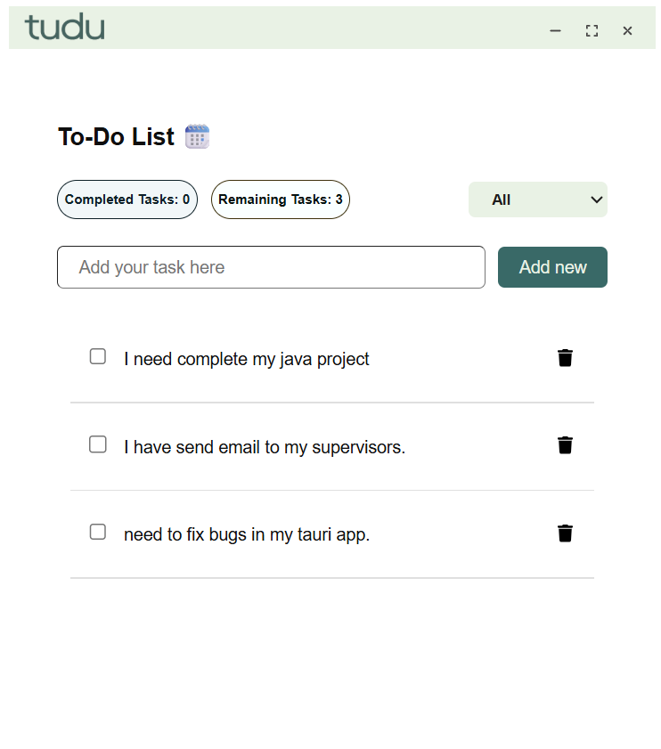

# ✅ tudu - ToDo Desktop App

**tudu** is a minimal, user-friendly **desktop ToDo application** built using [Tauri](https://tauri.app/). Designed to help users manage daily tasks, it provides a smooth experience with a clean interface for organizing and tracking progress on your tasks.

---

## 🚀 Features

- ✍️ **Add tasks** quickly and easily  
- 🗑️ **Delete** tasks that are no longer needed  
- ✅ **Mark tasks as completed** to track progress  
- 📊 **Real-time task summary** showing:
  - Total completed tasks
  - Remaining tasks  
- 🖥️ Clean and minimal **desktop UI**

---

## 🧭 How It Works

- You can create a task using the input field.
- Each task can be marked as **done** or **deleted**.
- The UI shows how many tasks you've completed and how many are remaining.
- Tasks update instantly and are stored locally on your device.

---

## 📦 Installation

## 🛠️ Development Setup

To run the app locally or contribute:

### Prerequisites

- [Node.js](https://nodejs.org/)
- [Rust](https://www.rust-lang.org/tools/install)
- [Tauri CLI](https://tauri.app/v1/guides/getting-started/setup)

### Steps

```bash
# Clone the repo
git clone https://github.com/RuwandiM/todo-desktop-app
cd todo-desktop-app

# Install dependencies
npm install

# Run the app
npm run tauri dev
```
---

### 📸 Screenshots


### 🧩 Tech Stack
- Frontend: React, css
- Backend: Rust (Tauri)
- Build Tooling: Tauri + Node

